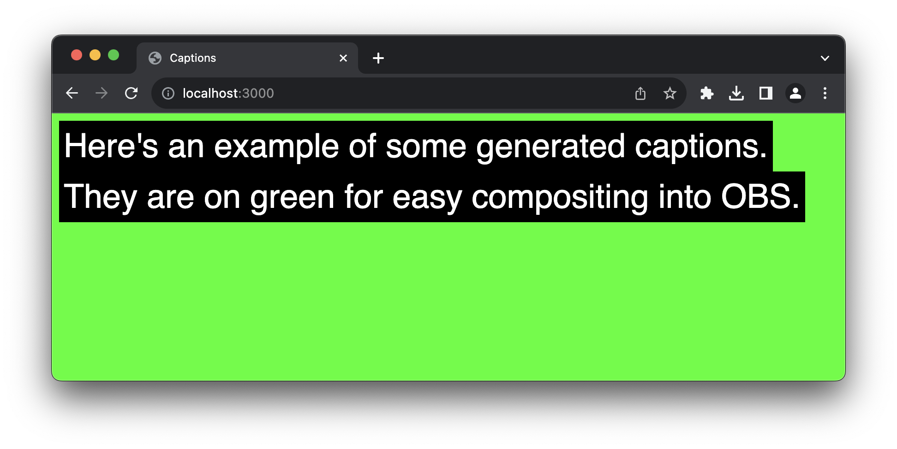

# Rev.AI Real Time Audio Stream Transcription

A microsite for generating captions from an incoming audio stream.

## Requirements

Node v20.7.0

## Install

`npm install`

## Run

Rename `.env-example` to `.env` and set the `REVAI_ACCESS_TOKEN`.

Run

`node app.js`

Open a browser and go to `localhost:3000`
